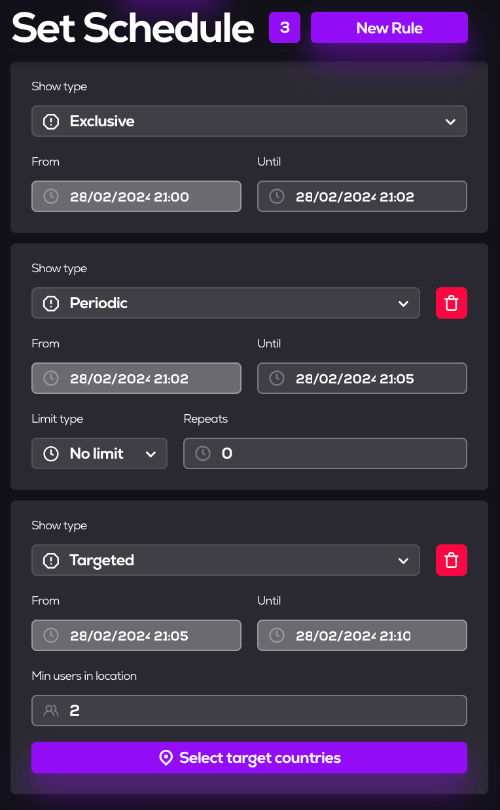

# Campaign Creation

## Introduction
This document is an instruction on how to work with *campaigns* and how create it.

## 1. Opening the [**MetaAds**](https://metaads.team/main/) website

* Connect
* Click on *Advertiser*
* Click on *My Campaigns*

## 2. Creating a **Campaign** with *Exclusive Rule*

* Enter *Name* (1)
* Enter *Describe* (2)
* Select the exact date, start and finish time of the *campaign* (3)
* Select the desired target [*audience*](https://github.com/MetaAdsTeam/audience-creation) (4)
* Click on *Next Step* button

##
> The next step is the schedule, where the necessary rules are selected to control the campaign time.
* Click on *Next step* button (1)
* Select the *advertising space* where our *campaign* will be performed (2)
* Click on *Next Step* button (3)

##
> The last step is the *review and budget*. As we can see, the price for publishing a *campaign* on this advertising space is shown, taking into account *Metaads fee* and your budget. We can launch a *campaign* and wait for the appointed time.

* Click on *Start Campaign* 

**The Campaign** has been created and is already displayed on the page with *On Hold* status. 

##
*The Ads* are displayed in the selected space.
 

## 3. About **Campaigns**

As you noticed, **Campaigns** have three rules:
* *Exclusive* - it takes up the entire campaign time. 

* *The periodical* is divided into two types: 

  * *No limit* (the number of impressions of the creative for a certain time)
  * *No more than every* (the number of impressions no more often than for a given time). 

* *Targeted* - works only if a certain number of users are present on the selected scene (you can also select a certain country).

   
> The *rules* can be combined and their timing can be chosen as needed.
